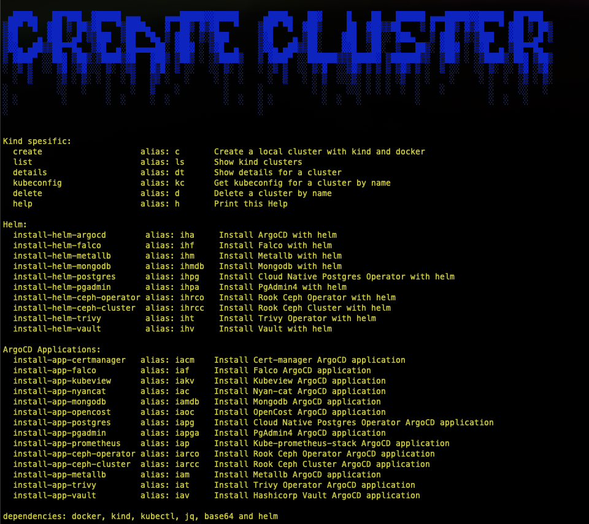

# createlocalk8s

Create a kubernetes cluster locally

:exclamation: for now this script only supports unix-systems (wsl2, unix, cygwin, etc)

# Prerequisites

- docker
- kind
- kubectl
- helm
- jq
- base64

# How to run?

```bash
./create-cluster.sh
```



Read the steps in
[./docs/k8s.md](./docs/k8s.md)
